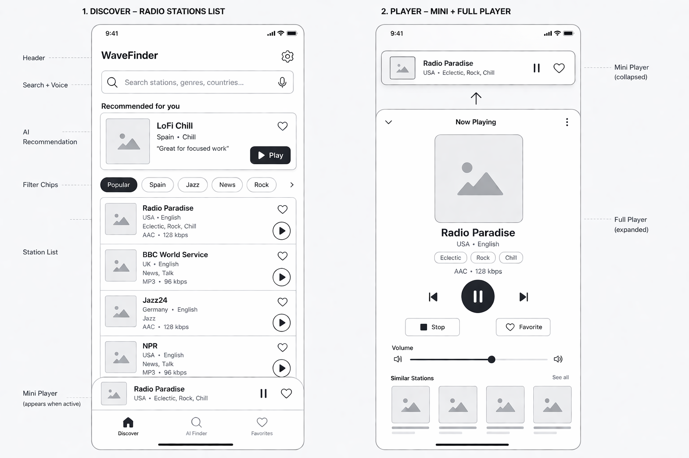

# RadioBrowser

RadioBrowser is a Flutter take-home project for browsing and listening to internet radio stations on Android and iOS.

## Status

Core browsing, playback, favorites, and the first AI-assisted station discovery flow are in progress phase by phase.

## Design Reference

The first implementation pass was based on this initial wireframe for the discover list, mini player, and full player flow:



## Demo Video


https://github.com/user-attachments/assets/2b1810c4-3523-47a5-a876-319d6daf34b0


## Requirements

- Flutter stable with Dart 3.7 or newer
- Android Studio or Xcode for running on mobile simulators/devices
- Android API 23 or newer
- No API key is required for Radio Browser station data
- OpenAI features are optional and must be enabled with Dart defines

## Getting Started

```sh
flutter pub get
flutter run --dart-define-from-file=.dart_defines/openai.local.json
```

If you are running without AI features, you can omit the Dart define file:

```sh
flutter run
```

### Running On Devices

List available devices:

```sh
flutter devices
```

Run on an Android emulator or device:

```sh
flutter run -d <android-device-id> --dart-define-from-file=.dart_defines/openai.local.json
```

Run on an iOS simulator:

```sh
flutter run -d <ios-simulator-id> --dart-define-from-file=.dart_defines/openai.local.json
```

Run on a physical iPhone:

```sh
flutter run -d <iphone-device-id> --dart-define-from-file=.dart_defines/openai.local.json
```

Some iOS 26 physical devices can crash in Flutter debug mode with:

```text
virtual_memory_posix.cc: error: mprotect failed: 13 (Permission denied)
```

That is a Flutter debug/JIT issue on device, not an app crash. Until your local Flutter SDK is upgraded to a version that contains the fix, run the iPhone in profile mode:

```sh
flutter run --profile -d <iphone-device-id> --dart-define-from-file=.dart_defines/openai.local.json
```

Profile mode does not support hot reload, but it uses the same ahead-of-time compilation style as release builds and is useful for tester validation on real iPhones.

### Android Text Or Icon Rendering Issues

On some Android devices or emulators, Flutter text and Material icon glyphs can appear visually scrambled while the layout itself is still correct. This is usually a renderer/GPU driver issue with the local Flutter/Android graphics stack, not broken API data or localization strings.

To confirm the diagnosis, run with software rendering:

```sh
flutter run --enable-software-rendering -d <android-device-id> --dart-define-from-file=.dart_defines/openai.local.json
```

If the text renders normally with software rendering, update Flutter stable and rebuild the app. Software rendering is useful for debugging, but it is not the preferred long-term runtime mode.

## OpenAI Setup

For this interview project, OpenAI can be called directly from the Flutter app so the project works without a backend. This is acceptable for local/demo use, but not ideal for a real production app because mobile binaries can be inspected. The production-grade version would move OpenAI calls behind a backend proxy and keep `OPENAI_API_KEY` only on the server.

The current best no-backend setup is:

- Keep real keys out of git.
- Use an ignored local Dart define file for development.
- Let CI inject release keys from encrypted CI secrets.
- Keep OpenAI isolated behind the `ai_finder` feature so it can later be swapped to a backend data source.

Create your local config from the example:

```sh
cp .dart_defines/openai.example.json .dart_defines/openai.local.json
```

Edit `.dart_defines/openai.local.json`:

```json
{
  "OPENAI_API_KEY": "your_key_here",
  "OPENAI_MODEL": "gpt-5-mini",
  "OPENAI_TRANSCRIPTION_MODEL": "gpt-4o-mini-transcribe"
}
```

Run with AI ranking and voice search transcription:

```sh
flutter run --dart-define-from-file=.dart_defines/openai.local.json
```

Android Studio setup:

1. Open **Run > Edit Configurations**.
2. Select the RadioBrowser Flutter run configuration.
3. Add this to **Additional run args** if it is not already there:

```sh
--dart-define-from-file=.dart_defines/openai.local.json
```

This repo also includes a local Android Studio run configuration named `main.dart` with that argument prefilled, so after creating `.dart_defines/openai.local.json`, running that configuration injects the OpenAI settings automatically.

You can still pass values manually when needed:

```sh
flutter run \
  --dart-define=OPENAI_API_KEY=your_key_here \
  --dart-define=OPENAI_MODEL=gpt-5-mini \
  --dart-define=OPENAI_TRANSCRIPTION_MODEL=gpt-4o-mini-transcribe
```

Do not commit API keys. Without `OPENAI_API_KEY`, the app falls back to normal Radio Browser search and the voice search button shows that AI search is unavailable.

The `.dart_defines/*.json` files are ignored by git, except for checked-in example files. Keep real keys only in `.dart_defines/openai.local.json` locally or inject them from encrypted CI secrets for release builds.

## Background Audio And System Controls

RadioBrowser uses `just_audio_background` on top of `just_audio` so playback can continue outside the app and publish metadata to system media controls:

- iOS: lock screen, Control Center, and system Now Playing surfaces. On Dynamic Island devices, iOS decides when the active media session is shown there.
- Android: foreground media notification with playback controls.

If audio pauses when leaving the app, rebuild after running `flutter pub get`; the iOS app must include `UIBackgroundModes/audio`, and Android must include the media playback foreground service.

### CI Release Injection

In CI, store the real key as an encrypted secret named `OPENAI_API_KEY`. Then generate a temporary Dart define file during the build and pass it to Flutter.

Example GitHub Actions step:

```yaml
- name: Create Dart defines
  env:
    OPENAI_API_KEY: ${{ secrets.OPENAI_API_KEY }}
  run: |
    mkdir -p .dart_defines
    cat > .dart_defines/openai.ci.json <<EOF
    {
      "OPENAI_API_KEY": "$OPENAI_API_KEY",
      "OPENAI_MODEL": "gpt-5-mini",
      "OPENAI_TRANSCRIPTION_MODEL": "gpt-4o-mini-transcribe"
    }
    EOF

- name: Build Android release
  run: |
    flutter build appbundle \
      --release \
      --dart-define-from-file=.dart_defines/openai.ci.json
```

For iOS release builds, use the same define file:

```sh
flutter build ipa \
  --release \
  --dart-define-from-file=.dart_defines/openai.ci.json
```

## Checks

```sh
dart format .
flutter analyze
flutter test
```

## App Icon

Launcher icons are generated from `assets/illustrations/app_icon.png` using `flutter_launcher_icons`.

Regenerate Android and iOS icons after changing the source image:

```sh
dart run flutter_launcher_icons
```

## Debugging Radio Browser API Calls

To force a debug-only startup smoke request, run:

```sh
flutter run --dart-define=RADIO_BROWSER_API_SMOKE=true
```

In Android Studio, add this to the run configuration's **Additional run args**:

```sh
--dart-define=RADIO_BROWSER_API_SMOKE=true
```

Then filter Run output or Logcat for:

```text
RadioBrowserAPI
```

## Architecture

The project uses a feature-first structure under `lib/src`:

- `app`: application bootstrap, dependency injection, navigation when needed, and theme setup
- `core`: shared configuration, networking, error handling, and reusable widgets
- `features`: isolated product areas with `data`, `domain`, and `presentation` boundaries

State management uses BLoC/Cubit via `flutter_bloc` and `equatable`. Data access uses `dio`, playback is isolated behind a `just_audio`/`audio_session` service, and local favorites use a small persistence abstraction over Hive.

OpenAI integration lives behind the `ai_finder` feature boundary. The app sends only real Radio Browser candidate stations to OpenAI and accepts only returned station UUIDs that already exist in that candidate list.
